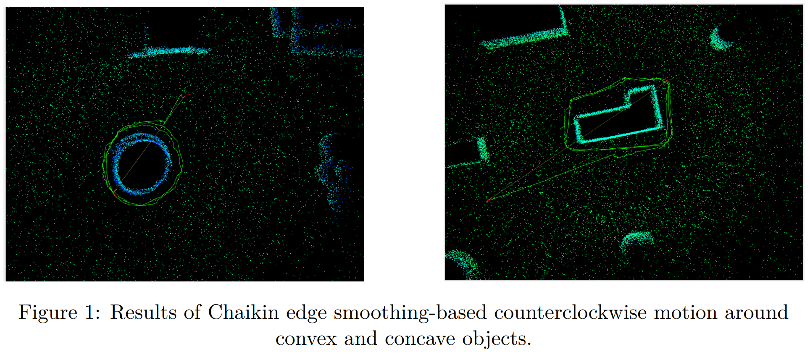
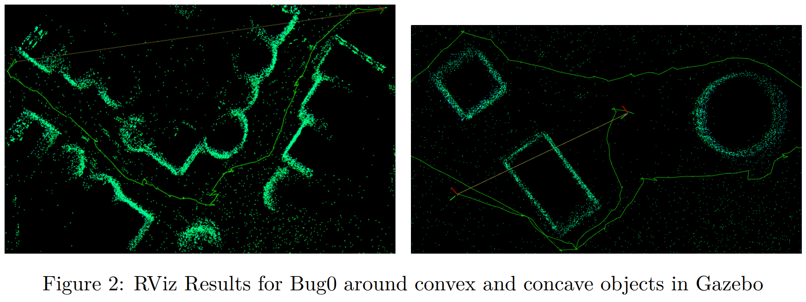

# Real-time Local Path Planning for Unitree Go2 Legged Robot

**Authors:** Sanan Garayev, Enis Yalcin, Ziya Ruso 
**Year:** 2025

---

## Overview

This project implements and compares three local path planning algorithms for a legged robot in ROS2, visualized in RViz and tested in simulation with convex and concave obstacles. The tasks explore edge-following techniques, Bug0 and Bug1 algorithms, with enhancements such as:

- Chaikin curve smoothing  
- Waypoint filtering  
- Robust recovery behaviors  

---

## Tasks Overview

Each task demonstrates a unique path-planning strategy:

- **Task 1:** Counterclockwise wall following using local edge detection  
- **Task 2:** Bug0 algorithm with direct and obstacle-avoidance modes  
- **Task 3:** Bug1 algorithm that tracks hit/leave points and resumes goal motion  

Each task uses separate launch files and is executed in parallel terminal sessions.

---

## Task 1 – Counterclockwise Edge Following

An edge-following algorithm that keeps the robot navigating around obstacles in a counterclockwise direction.

### Key Features:
- **Chaikin’s Smoothing:** Refines obstacle edges
- **Waypoint Filtering:** Ensures distance threshold (1.5m) before publishing
- **Stuck Detection:** Triggers recovery if movement <10cm in 2 seconds
- **Edge Extension:** Adds 50cm if robot reaches end of a path

### Chaikin’s Algorithm Formula
```math
Q_i = \frac{3}{4}P_i + \frac{1}{4}P_{i+1}, \quad R_i = \frac{1}{4}P_i + \frac{3}{4}P_{i+1}
```


### Execution Steps

#### Terminal 1 – Launch Gazebo, SLAM, Robot
```bash
xhost +
sudo docker container start comp0244_unitree
sudo docker exec -it comp0244_unitree /bin/bash
source /usr/app/comp0244_ws/comp0244-go2/install/setup.bash
cd /usr/app/comp0244_ws/comp0244-go2/
colcon build
cd scripts
ros2 launch robot_launch.launch.py
```

#### Terminal 2 – Publish Waypoint
```bash
sudo docker exec -it comp0244_unitree /bin/bash
source /usr/app/comp0244_ws/comp0244-go2/install/setup.bash
ros2 topic pub /waypoint geometry_msgs/Pose2D "{x: -1.0, y: 0.0, theta: 0.0}" -r 1
# Ctrl+C after message is published
```

#### Terminal 2 – Launch Task 1
```bash
ros2 launch cw1_team_12 run_solution_task_1.launch.py
```

---

## Task 2 – Bug0 Algorithm

Bug0 uses a reactive planner that switches between `GO_TO_GOAL` and `AVOID_OBSTACLE` states based on obstacle proximity.

### Key Features:
- Curvature-based edge processing
- Chaikin smoothing
- Hysteresis-controlled state transitions
- EMA-smoothed waypoints



### Execution Steps

#### Terminal 1 – Launch Robot and Environment
(same steps as Task 1 Terminal 1)

#### Terminal 2 – Launch Bug0
```bash
ros2 launch cw1_team_12 run_solution_task_2.launch.py
```

#### Terminal 3 – Publish Goal
```bash
ros2 topic pub /goal geometry_msgs/Pose2D "{x: 8.0, y: 8.0, theta: 0.0}"
```

---

## Task 3 – Bug1 Algorithm

Bug1 enhances obstacle navigation by tracking hit and leave points.

### Modes:
- `go_to_goal`
- `follow_boundary_to_hit_point`
- `follow_boundary_to_leave_point`
- `goal_reached`

### Key Features:
- **Hit/Leave Points:** Tracks entry/exit near obstacles
- **Angular Smoothing:** Simplifies jagged boundaries
- **Recovery Rotations:** ±60° if stuck
- **Stagnation Handling:** Resets hit point if diverged


### Execution Steps

#### Terminal 1 – Launch Robot and Environment
(same steps as Task 1 Terminal 1)

#### Terminal 2 – Launch Bug1
```bash
ros2 launch cw1_team_12 run_solution_task_3.launch.py
```

#### Terminal 3 – Publish Goal
```bash
ros2 topic pub /goal geometry_msgs/Pose2D "{x: 0.0, y: 5.0, theta: 0.0}"
```

---

## Visual Outputs

- Visualized using RViz
- Marker colors:
  - Green = Goal  
  - Red = Hit Point  
  - Blue = Leave Point  

---

## Technologies Used

- ROS2 Foxy/Galactic
- RViz (3D visualization)
- Chaikin algorithm (curve smoothing)
- Python/C++ ROS2 packages
- Docker-based ROS environment

---

## Future Work

- Add global planner with SLAM integration
- Real-world Unitree deployment
- Tune parameters (hysteresis, distance margins) for generalization

---

## Reference

Chaikin, G. M. (1974).  
*An algorithm for high-speed curve generation*.  
Computer Graphics and Image Processing, 3(4), 346–349.  
[Link to paper](https://www.sciencedirect.com/science/article/pii/0146664X74900288)

---

## License

This project is licensed under the MIT License.  
© Team 12 – UCL COMP0244, 2025
